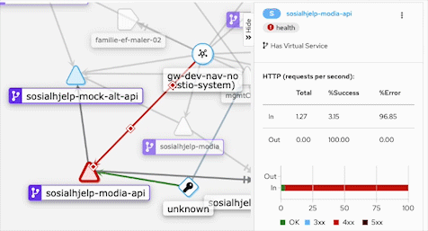

# Distributed tracing

When program flow is distributed across many microservices, the need arises to trace across them.

With no code changes necessary, NAIS leverages Istio and the Kiali dashboard to give developers a visualization of the service mesh and its general health.

NAIS supports two different methods of distributed tracing: Either by [direct submission of tracing data to Jaeger](#trace-headers), or [envoy-based tracing](#envoy-based-extraction).

## Visualizing service mesh with Kiali




## Envoy-based context extraction

**TODO: Create illustration**

NAIS can be configured to set the istio-proxy sidecar to transparently supply tracing data to jaeger, by extracting context data from headers attached to HTTP calls.

The advantage to this approach is that it allows you to get up and running quickly with distributed tracing with relatively minimal changes needed to your code base. The disadvantage is that it allows only tracing on 

### NAIS configuration

To enable envoy-based tracing, add the following stanza to nais.yaml under "spec":

```
spec:
  tracing:
    enabled: true
    envoySampling: 100
```

To give Jaeger sufficient context to reconstruct a trace, the application must read a set of HTTP headers from the incoming request and forward them to any requests further down the chain.

### Trace headers

*See also [Istio's documentation](https://istio.io/latest/faq/distributed-tracing/#how-to-support-tracing)*

The following trace headers must be forwarded as they are received:

* `x-b3-traceid`
* `x-b3-spanid`
* `x-b3-parentspanid`
* `x-b3-sampled`
* `x-b3-flags`

**TODO: Check source code to find which headers are actually dealt with by istio-proxy**

**TODO: Figure out semantics of the sampled/flags headers** 

### Code examples

Tracing was initially deployed in NAIS in collaboration with team digisos, who used envoy-based tracing to find the source of slow page loads.

#### React

The following code generates a 128-byte UUID, which is split into two 64-bit identifiers.

**TODO: Clarify jaeger's requirements**

```
// In the file top level
import { v4 as uuidv4 } from 'uuid';
const sessionTraceID = uuidv4().toString().replaceAll('-','');

        // Inside the request method
        headers.append('X-B3-TraceId', sessionTraceID.substr(0, 16));
        headers.append('X-B3-SpanId', sessionTraceID.substr(16, 16));
```

## Direct submission

The user may send tracing data to jaeger via [a plethora of supported protocols](https://www.jaegertracing.io/docs/1.20/apis/), including OpenTracing, Thrift and Zipkin. A [robust ecosystem of libraries](www.jaegertracing.io) exist for several languages.

To enable traffic to the tracing service, add the following stanza to nais.yaml under "spec":

```
spec:
  tracing:
    enabled: true
```

**TODO: Include code example / screenshot**
